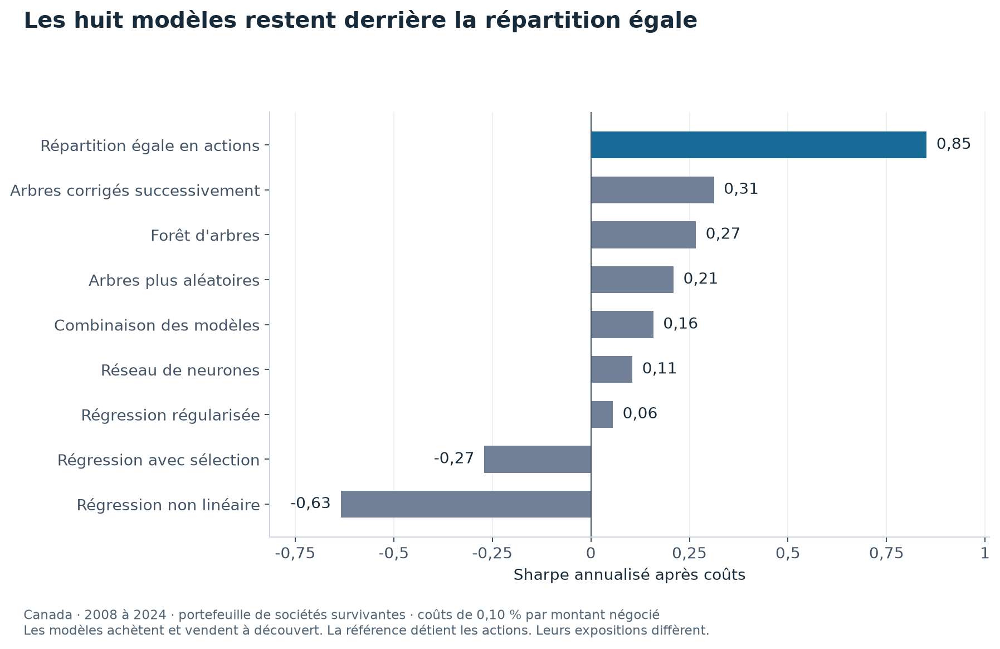

# Un ordinateur peut-il mieux choisir des actions après avoir payé les frais ?

Un ordinateur peut chercher des liens entre l'économie et les prix des actions. Mais un résultat historique peut être trompeur si le programme utilise une information connue seulement plus tard, ou s'il oublie les frais.

Ce projet reprend la question de mon mémoire avec des contrôles supplémentaires. Les réglages des modèles sont choisis avant la période de test. Chaque achat et vente est facturé.

**Aucun des huit modèles ne dépasse la répartition égale dans les deux univers étudiés.** Cela décrit ces expériences sur 2008 à 2024. Ce n'est pas une conclusion générale sur toute utilisation de l'intelligence artificielle.

## Comparer le résultat avec une règle simple

| Portefeuille canadien | Rendement annuel composé après frais | Sharpe |
|---|---:|---:|
| Meilleur modèle testé, arbres corrigés successivement | 4,1 % | 0,31 |
| Même somme dans chaque action | 11,4 % | 0,85 |

Le Sharpe mesure le rendement au-delà du taux sans risque, rapporté aux variations du rendement. Les valeurs proviennent de la [table canadienne](results/tables/walk_forward_canada.csv). Les [résultats américains](results/tables/walk_forward_usa.csv) sont présentés séparément.



Chaque barre montre le compromis entre rendement et variabilité après coûts. La barre bleue répartit l'argent également entre les actions. Elle dépasse les huit modèles sur cet échantillon, avec une exposition au marché différente.

## Pourquoi un signal ne suffit pas

Les modèles achètent les actions qu'ils classent en haut et vendent à découvert celles du bas. Vendre à découvert revient à vendre une action empruntée, puis à la racheter. Le pari porte donc sur l'écart entre deux groupes.

Changer souvent de classement oblige à beaucoup négocier. Le coût retenu est de **0,10 % par montant échangé**. Plusieurs modèles échangent l'équivalent de deux à trois portefeuilles par mois.

La comparaison est aussi répétée sur plusieurs découpages temporels. Un contrôle tient compte du nombre de réglages essayés, car essayer davantage augmente les chances de trouver un bon résultat par hasard.

## Les réserves à garder en tête

Les modèles achètent et vendent à découvert, tandis que la référence détient simplement les actions. Leurs expositions au marché diffèrent. Les sociétés retenues sont des survivantes et les données économiques utilisent des historiques révisés.

Le fichier américain contient aussi des séries en niveaux non transformés, contrairement au fichier canadien. Cette différence empêche d'attribuer l'écart entre pays à une cause unique. Tous ces défauts restent détaillés dans l'étude liée ci-dessous.

## Refaire les calculs

```bash
uv sync --locked --all-extras
uv run pytest
uv run m2 figures --country both
```

Le calcul complet utilise `uv run m2 run --country both`. Il nécessite les fichiers macroéconomiques déposés manuellement selon l'étude détaillée et peut être long. La commande de figures utilise les résultats déjà disponibles. Le graphique de présentation se régénère hors réseau avec `uv run python scripts/figure_presentation.py`, depuis les tableaux publiés.

## Pour aller plus loin

[Méthodes, résultats complets et références](docs/ETUDE_DETAILLEE.md) · [Présentation en PDF](rapport/rapport.pdf) · [Licence](LICENSE).

## English summary

Eight tested models fail to beat equal weighting after transaction costs. The study controls timing and repeated trials, while retaining declared limits involving survivor stocks, revised macro data and untransformed US series.
