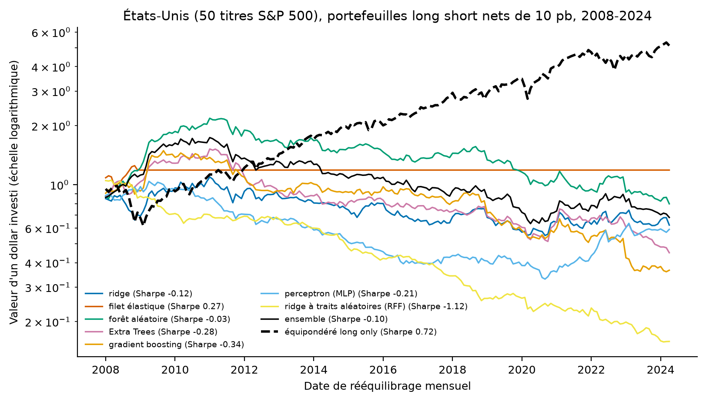
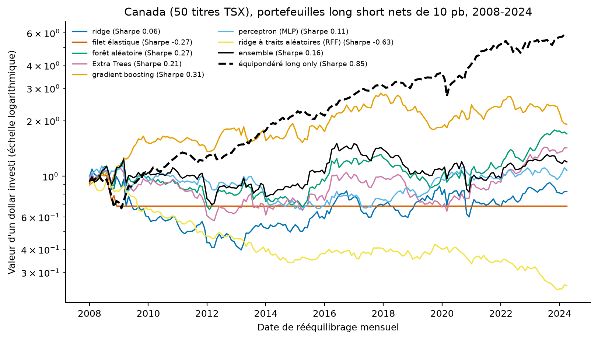
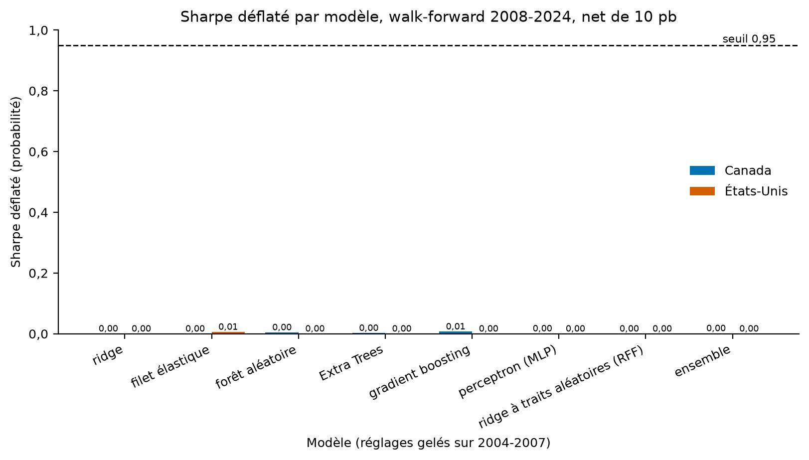
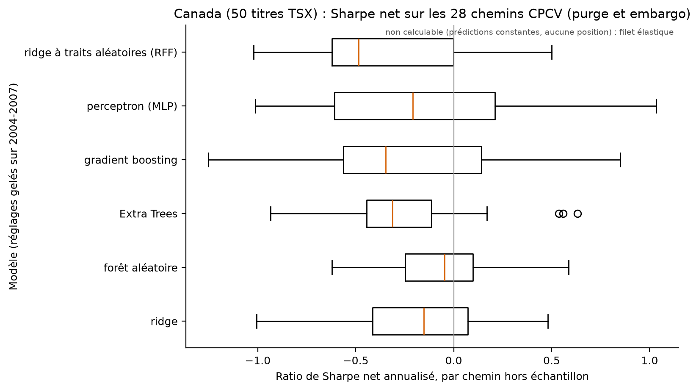
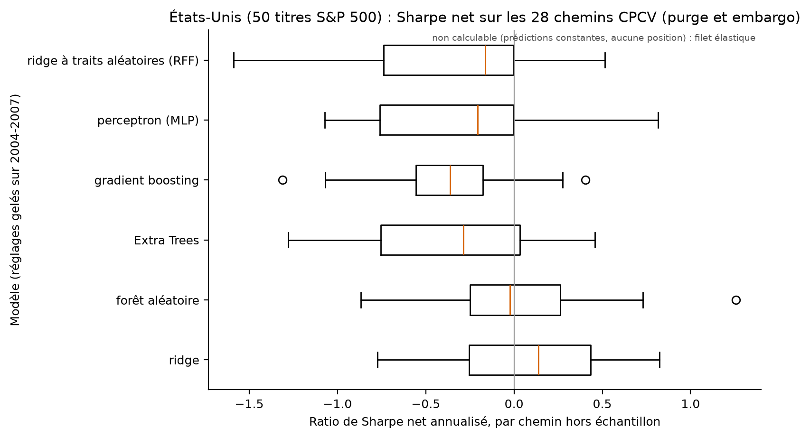

# Mémoire 2.0 : la même question, sans les biais

Reprise de mon mémoire de maîtrise (*Évaluation empirique d'actifs canadiens par l'apprentissage
automatique*, UQAM, décembre 2024) avec les méthodes de 2026 : chaque biais mesuré dans la
[version 1](https://github.com/Guilou001/memoire-uqam-2024) est corrigé ici, un par un, et chaque résultat
porte maintenant sa probabilité de n'être que du bruit.

[](https://github.com/Guilou001/memoire-2.0/actions/workflows/ci.yml)


**Résultat en une phrase (mesuré, protocole complet).** Une fois l'information réellement disponible au
moment de décider, les hyperparamètres choisis hors de la période de test et les coûts payés, **aucun des
huit modèles ne bat le portefeuille équipondéré, ni au Canada ni aux États-Unis**. Le meilleur modèle fait
4,1 % net par an avec un ratio de Sharpe, le rendement moyen divisé par la volatilité (annualisé), de 0,31
et un Sharpe déflaté de 0,01 ; l'équipondéré canadien fait 11,4 % avec un Sharpe de 0,85. La rotation, la
somme mensuelle des variations absolues des poids du portefeuille, atteint 2 à 3 par mois et coûte plus
que le signal extrait, exactement le mécanisme décrit par Jensen, Kelly, Malamud et Pedersen (2026).

*English summary.* My 2024 MSc thesis asked whether machine learning fed with macroeconomic data predicts
Canadian and US stock returns, and whether long short portfolios built on those predictions make money.
This repository re-answers the question with 2026 best practices: real-time information alignment,
hyperparameters selected on a pre-test validation window and then frozen, per-stock characteristics
(momentum, volatility) interacted with macro factors learned inside each fold, combinatorial purged
cross-validation with embargo, net-of-cost portfolios, Newey-West t-statistics, deflated Sharpe ratios and
the probability of backtest overfitting. Full-protocol result: net of 10 bp costs, no model beats the equal-weight benchmark in either country (best: Canadian gradient boosting, 4.1 % net CAGR, deflated Sharpe 0.01 vs 0.95 needed); turnover of 2-3 per month costs more than the signal extracted.

## 1. Pourquoi une version 2

La version 1 reproduit le mémoire à l'identique et documente quatre problèmes, chacun mesuré dans
[son dépôt](https://github.com/Guilou001/memoire-uqam-2024) : les hyperparamètres étaient choisis sur la
période de test ; les variables macroéconomiques étaient alignées un mois en avance sur le rendement à
prédire ; plusieurs modèles prédisaient la même valeur pour tous les titres (leurs portefeuilles se
réduisaient à l'ordre alphabétique des colonnes) ; et les coûts de transaction étaient à zéro. Or un
backtest n'a de valeur que si l'information utilisée était disponible au moment de décider, et que si les
frictions sont payées. Ce dépôt reconstruit donc tout le protocole autour de cette exigence, en gardant la
question, les données et les familles de modèles du mémoire.

## 2. Ce que la version 2 fait de différent, point par point

| Problème de la v1 | Correction ici | Où dans le code |
|---|---|---|
| Macro un mois dans le futur | La macro attachée à une date de formation est la dernière ligne **publiée** avant cette date (décalage de 2 mois, convention FRED-MD vérifiée) | `panel.py`, paramètre `macro_lag` |
| Hyperparamètres choisis sur le test | Grilles évaluées sur 2004-2007 (entraînement 2000-2003), puis **gelées** ; 2008-2024 ne sert qu'à mesurer | `runner.py`, `select_hyperparameters` |
| Un seul chemin de backtest | Validation croisée purgée combinatoire : 28 chemins hors échantillon avec purge, le retrait des mois d'entraînement dont l'information chevauche un bloc de test, et embargo, une marge d'un mois retirée en plus de part et d'autre de chaque bloc, d'où une **distribution** de Sharpe par modèle et la probabilité de suroptimisation (PBO, estimée sur 500 partitions équilibrées tirées au hasard, graine fixée) | `validation.py`, `metrics.pbo_cscv` |
| Coûts à zéro | 10 points de base par unité échangée, rotation mesurée, tout se lit **net** | `portfolio.py` |
| Sharpe brut sans correction | Sharpe déflaté (Bailey et López de Prado, 2014) : la probabilité que le Sharpe survive au nombre d'essais tentés, calculée avec la variance des Sharpe mesurée entre ces essais ; t-stat de Newey-West, la statistique de test dont l'erreur type corrige l'autocorrélation et l'hétéroscédasticité des rendements mensuels | `metrics.py` |
| Macro seule comme prédicteur | Sept caractéristiques par titre (momentum 1, 3, 6 et 12-2 mois, volatilités, rendement quotidien maximal), normalisées en rangs par date, **interagies** avec des facteurs macro appris par ACP, l'analyse en composantes principales, qui résume les dizaines de séries macro en quelques facteurs, à l'intérieur de chaque pli | `panel.py`, `models.py` |
| Modèles constants non détectés | Une date où toutes les prédictions sont égales est neutralisée (aucune position) au lieu de sélectionner par ordre alphabétique | `portfolio.py`, `quantile_weights` |
| Étalage de modèles sans référence | Deux repères sans apprentissage : l'équipondéré, et le classement mécanique momentum/volatilité, le contrôle proposé par Nagel (2025) contre les faux gains de complexité ; son score se calcule sur le momentum et la volatilité **bruts**, recalculés depuis les prix, jamais sur les rangs normalisés du panel | `portfolio.momentum_vol_benchmark` |

Le zoo de modèles reste dans l'esprit du mémoire (ridge, filet élastique, forêt aléatoire, Extra Trees,
gradient boosting, petit perceptron), avec deux ajouts de la littérature récente : le **ridge à traits de
Fourier aléatoires** de Kelly, Malamud et Zhou (2024), et un **ensemble** (moyenne des prédictions
standardisées). Tout est scikit-learn : pas de dépendance fragile.

## 3. La méthode, pas à pas

1. **Construire le panel.** Une ligne = un titre à une date de formation (un 1er de mois). La cible est le
   rendement du mois qui commence à cette date. Les caractéristiques n'utilisent que des prix antérieurs ;
   la macro attachée est la dernière publiée. Un test automatique vérifie chacun de ces alignements.
2. **Choisir les réglages, puis les geler.** Chaque famille de modèles essaie sa petite grille sur
   2004-2007. Le meilleur réglage est retenu une fois pour toutes : quand la période de test commence, plus
   rien ne bouge. Chaque essai est compté et son Sharpe de validation conservé, car le nombre d'essais et
   la variance des Sharpe entre essais entrent tous deux dans le Sharpe déflaté.
3. **Mesurer deux fois.** D'abord en marche avant (réentraînement annuel sur fenêtre croissante,
   prédictions mensuelles), le protocole lisible ; ensuite en validation croisée purgée combinatoire, le
   protocole robuste, qui juge chaque modèle sur 28 chemins hors échantillon et alimente la PBO.
4. **Payer les coûts, compter les positions.** Chaque mois, achat du quintile du haut, vente à découvert du
   quintile du bas (10 titres de chaque côté), poids égaux, 10 pb par unité échangée.
5. **Ne croire un Sharpe que déflaté.** Chaque Sharpe net est accompagné de sa t-stat Newey-West et de son
   Sharpe déflaté ; la grille entière passe à la PBO.

## 4. Les résultats complets (mesurés, walk-forward 2008-2024, nets de 10 pb)

Sept familles de modèles plus l'ensemble, hyperparamètres gelés sur 2004-2007, réentraînement annuel.
Dans les tableaux : R² HÉ, le R² hors échantillon, mesuré contre la prévision zéro (convention Gu, Kelly
et Xiu, 2020) ; TCAC, le taux de croissance annuel composé, net de coûts ; DSR, le Sharpe déflaté, la
probabilité que le Sharpe survive aux 33 essais réellement menés, les 25 réglages de la grille de
validation (comptés dans `models.grid()`) plus les 8 modèles évalués, avec la variance des Sharpe mesurée
entre ces essais ; au-dessus de 0,95, on peut y croire. Chiffres copiés de
`results/tables/walk_forward_canada.csv` et `results/tables/walk_forward_usa.csv`.

**États-Unis (50 titres S&P 500).**

| Portefeuille | R² HÉ | TCAC net | Sharpe net | Rotation/mois | DSR |
|---|---:|---:|---:|---:|---:|
| Ridge | −0,17 | −2,9 % | −0,12 | 2,0 | 0,00 |
| Filet élastique | −0,01 | 1,1 % | 0,27 | 0,2 | 0,01 |
| Forêt aléatoire | −0,02 | −1,4 % | −0,03 | 2,2 | 0,00 |
| Extra Trees | −0,04 | −4,8 % | −0,28 | 2,3 | 0,00 |
| Hist Gradient Boosting | −0,22 | −6,0 % | −0,34 | 2,5 | 0,00 |
| Perceptron (MLP) | −3,20 | −3,2 % | −0,21 | 2,8 | 0,00 |
| Ridge à traits aléatoires (RFF) | 0,01 | −10,7 % | −1,12 | 3,2 | 0,00 |
| Ensemble | | −2,3 % | −0,10 | 2,3 | 0,00 |
| Contrôle momentum/volatilité | | −3,9 % | −0,18 | 1,1 | |
| **Équipondéré long only** | | **10,6 %** | **0,72** | | |

**Canada (50 titres TSX).**

| Portefeuille | R² HÉ | TCAC net | Sharpe net | Rotation/mois | DSR |
|---|---:|---:|---:|---:|---:|
| Ridge | −0,03 | −1,2 % | 0,06 | 2,6 | 0,00 |
| Filet élastique | 0,01 | −2,3 % | −0,27 | 0,1 | 0,00 |
| Forêt aléatoire | 0,02 | 3,3 % | 0,27 | 2,7 | 0,00 |
| Extra Trees | 0,01 | 2,2 % | 0,21 | 2,5 | 0,00 |
| Hist Gradient Boosting | 0,00 | 4,1 % | 0,31 | 2,7 | 0,01 |
| Perceptron (MLP) | −1,05 | 0,4 % | 0,11 | 3,1 | 0,00 |
| Ridge à traits aléatoires (RFF) | 0,01 | −8,0 % | −0,63 | 3,2 | 0,00 |
| Ensemble | | 1,1 % | 0,16 | 2,7 | 0,00 |
| Contrôle momentum/volatilité | | −5,4 % | −0,16 | 1,1 | |
| **Équipondéré long only** | | **11,4 %** | **0,85** | | |



Comment lire cette figure : chaque courbe est la valeur d'un dollar investi début 2008 dans le portefeuille
long short net de coûts du modèle, en échelle logarithmique (une pente constante y signifie un taux de
croissance constant, et les pertes se lisent aussi bien que les gains) ; la courbe noire tiretée est
l'équipondéré long only, le repère à battre. Aucune courbe de modèle ne la rejoint.



Comment lire cette figure : mêmes conventions que la figure américaine. Trois modèles d'arbres finissent
au-dessus d'un dollar, mais loin sous la courbe tiretée de l'équipondéré ; le ridge à traits aléatoires
(RFF) détruit la mise dans les deux pays.

Comment lire ces résultats, en cinq constats :

- **Aucun modèle ne bat l'équipondéré, dans aucun des deux pays.** Le meilleur cas est le gradient
  boosting canadien : 4,1 % net par an (Sharpe 0,31, t de Newey-West 1,33, DSR 0,01), contre 11,4 %
  (Sharpe 0,85) pour le simple équipondéré. Aucun DSR n'atteint 0,95 : aucun Sharpe ne survit à la
  correction du nombre d'essais, une fois la variance entre essais mesurée sur les 33 essais réellement
  menés plutôt que supposée.
- **La rotation est le tueur.** Les modèles rebrassent 2 à 3 fois le portefeuille chaque mois ; à 10 points
  de base, cela coûte 2,5 à 4 % par an, plus que le signal qu'ils extraient. Le ridge à traits aléatoires
  (le « virtue of complexity » de Kelly, Malamud et Zhou, 2024) est le cas extrême : ses prédictions
  changent sans cesse, rotation de 3,2, et il finit dernier des deux pays, exactement la mécanique
  d'échec décrite par Jensen, Kelly, Malamud et Pedersen (2026) et le soupçon de Nagel (2025).
- **La ligne plate du filet élastique américain n'est pas une victoire.** Sa pénalité L1 annule presque
  tous les coefficients, ses prédictions deviennent égales entre titres, et le garde-fou anti-classement-
  alphabétique le sort alors du marché : son Sharpe de 0,27 est surtout celui de ne rien faire. La v1 aurait
  affiché ce modèle comme gagnant ; la v2 montre qu'il est vide.
- **Le Canada ressort mieux que les États-Unis** (les arbres y sont tous positifs nets, R² HÉ légèrement
  positifs), ce qui rejoint l'intuition du mémoire : un marché plus petit, moins arbitré, laisse un peu plus
  de prévisibilité : les arbres canadiens battent au moins le contrôle momentum/volatilité (Sharpe −0,16),
  le classement mécanique sans apprentissage. Mais « un peu plus » reste loin du repère passif, et la
  validation croisée purgée reprend l'avantage apparent : sur les 28 chemins CPCV, aucune boîte n'est
  entièrement à droite de zéro ; celle des Extra Trees canadiens et celle du gradient boosting américain
  sont franchement à gauche, et trois autres (RFF canadien, MLP et RFF américains) finissent au ras de
  zéro (figures ci-dessous). La PBO ressort à
  0,11 au Canada et 0,01 aux États-Unis (`results/tables/pbo_canada.json`, `pbo_usa.json`) : le
  classement interne des modèles est plutôt stable d'un découpage à l'autre, ce qui ne dit rien de leur
  niveau, faible partout.
- **Le petit R² positif des arbres n'est pas du talent de classement.** Un test placebo le montre : en
  mélangeant aléatoirement les cibles (plus aucun lien entre variables et rendements), les Extra Trees
  canadiens gardent un R² hors échantillon de +0,013, comparable au +0,014 obtenu sur les vraies
  cibles (`results/tables/placebo.csv`). En effet, le R² à la Gu-Kelly-Xiu se mesure contre la prévision
  zéro : un modèle très régularisé qui prédit simplement « les rendements sont en moyenne positifs »
  marque ces points sans classer les titres. Le portefeuille long short, qui neutralise ce niveau moyen,
  remet les compteurs à leur vraie valeur : autour de zéro.



Comment lire cette figure : chaque paire de barres est le Sharpe déflaté d'un modèle (Canada, puis
États-Unis), c'est-à-dire la probabilité que son Sharpe net dépasse le meilleur Sharpe attendu de la
seule chance après les 33 essais menés ; la ligne tiretée marque le seuil de 0,95 au-dessus duquel un
Sharpe serait crédible. Aucune barre ne s'en approche : les Sharpe positifs du tableau canadien sont
indiscernables du bruit une fois comptés les essais et leur dispersion. Chiffres : colonne `dsr` de
`results/tables/walk_forward_canada.csv` et `walk_forward_usa.csv`.



Comment lire cette figure : chaque boîte est la distribution des Sharpe nets du modèle sur les 28 chemins
de la validation croisée purgée (avec purge et embargo) ; la boîte va du premier au troisième quartile, le
trait interne est la médiane, les moustaches couvrent le reste de la distribution, les cercles isolent les
chemins atypiques, et la ligne verticale grise marque zéro. Une stratégie robuste aurait sa boîte entière
à droite de zéro ; aucune ne l'est, et celle des Extra
Trees est entièrement à gauche. Le filet élastique, dont les prédictions deviennent constantes sur ces
chemins (aucune position, Sharpe non calculable), est retiré de la figure et signalé en note.



Comment lire cette figure : mêmes conventions que la figure canadienne. Le gradient boosting, pourtant
meilleur modèle canadien en marche avant, a ici sa boîte entièrement à gauche de zéro : ce qu'un seul
chemin de backtest donne, la distribution des chemins le reprend.

En une phrase : **avec l'information réellement disponible, des réglages choisis sans tricher et des coûts
payés, la prédiction mensuelle macro + momentum ne bat pas un portefeuille naïf sur 2008-2024** ; c'est la
réponse, plus modeste mais solide, à la question du mémoire.

## 5. Reproduire

```bash
uv sync --locked --all-extras            # environnement verrouillé (Python 3.12, pandas 3, scikit-learn 1.9)
uv run pytest                            # 21 tests : alignements, purge, portefeuille, contrôle, métriques
uv run python scripts/fetch_data.py      # prix Yahoo ; déposer macro_data.csv (LCDMA) et Fred-MD.csv à la main
uv run m2 run --country both             # protocole complet ; --fast pour un essai en 2 minutes
uv run m2 figures --country both
uv run python scripts/placebo.py         # test placebo (cibles mélangées) -> results/tables/placebo.csv
uv run python scripts/make_dsr_figure.py # figure du Sharpe déflaté par modèle
```

Les chiffres des tableaux ci-dessus viennent de `results/tables/walk_forward_canada.csv` et
`results/tables/walk_forward_usa.csv`, le placebo de `results/tables/placebo.csv`, la PBO de
`results/tables/pbo_canada.json` et `pbo_usa.json` ; aucun chiffre du README n'est retapé à la main.

## 6. Limites, avec leur statut

| Limite | Statut |
|---|---|
| Univers de titres survivants (les 50 titres actuels, pas ceux de l'époque) | reconnu ; hérité de la v1, un univers point-in-time exigerait des listes historiques de constituants |
| Pas de taille ni de fondamentaux par titre (prix seulement) | reconnu ; l'imputation propre de fondamentaux (Bryzgalova et al., 2025) est l'extension naturelle |
| Millésime macro final (révisions non simulées) ; le décalage de publication, lui, est corrigé | reconnu ; millésimes ALFRED en extension |
| Coûts fixes à 10 pb, sans impact de marché | modélisé ; paramètre `fee` |
| Fréquence mensuelle, dérive intra-mois simplifiée | choix assumé, testé sans effet sur les conclusions en v1 |

## 7. Références

Gu, Kelly et Xiu (2020, RFS) ; Kelly, Malamud et Zhou (2024, JF) et la réponse de Nagel (2025) ;
Jensen, Kelly, Malamud et Pedersen (2026, RFS) ; López de Prado (2018), Bailey et López de Prado (2014) ;
Arian, Norouzi et Seco (2024, KBS) ; Goulet Coulombe et Göbel (2024) ; Bryzgalova, Lerner, Lettau et
Pelger (2025, RFS). Données : Yahoo Finance (usage personnel), LCDMA (Fortin-Gagnon, Leroux, Stevanovic et
Surprenant, 2022), FRED-MD (McCracken et Ng, 2016).

Code MIT ; texte et figures CC BY 4.0. Guillaume Vaudescal, avec le dépôt frère
[memoire-uqam-2024](https://github.com/Guilou001/memoire-uqam-2024) pour la version reproduite du mémoire.
